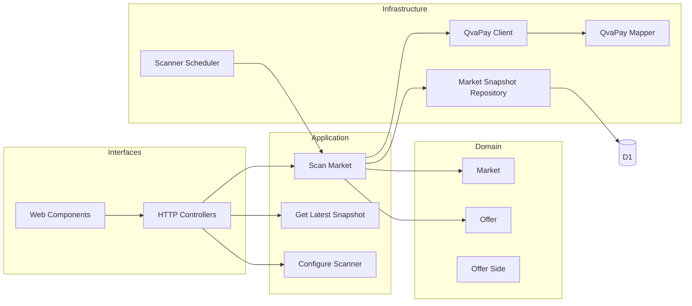

# Diagrama de componentes

> **Estado documental:** componentes objetivo/propuestos. La implementación actual se determina exclusivamente por el código existente y la matriz de trazabilidad.



## Regla de dependencias

Las dependencias deben apuntar hacia el dominio:

```
Interfaces → Application → Domain
Infrastructure → Application/Domain contracts
```

El dominio no debe importar APIs de Cloudflare, SDKs de QvaPay ni detalles de persistencia.