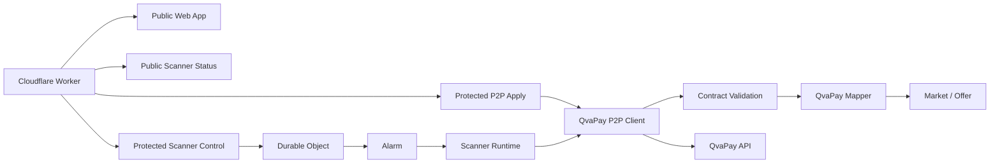

# Diagrama de componentes

## Estado

Componentes alineados con la implementación actual.



## Regla de dependencias

```text
Infrastructure → Application → Domain
```

El dominio no depende de Cloudflare ni de QvaPay.
