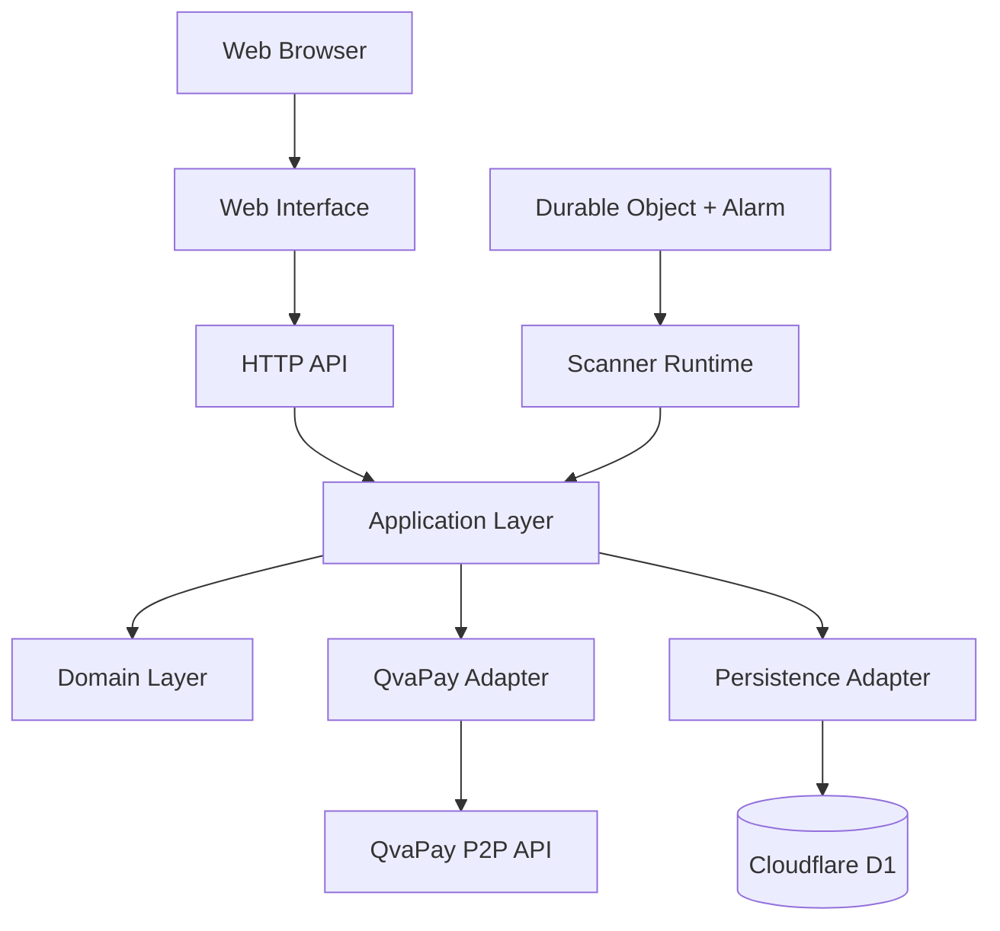

# Container Diagram

| Componente | Responsabilidad |
|---|---|
| Web Interface | Presentación y configuración |
| HTTP API | Frontera de entrada/salida |
| Application | Casos de uso |
| Domain | Reglas del dominio |
| Scanner Runtime | Ejecución del escaneo |
| Durable Object | Coordinación y programación |
| QvaPay Adapter | Integración externa |
| Persistence Adapter | Acceso a persistencia |
| D1 | Almacenamiento |