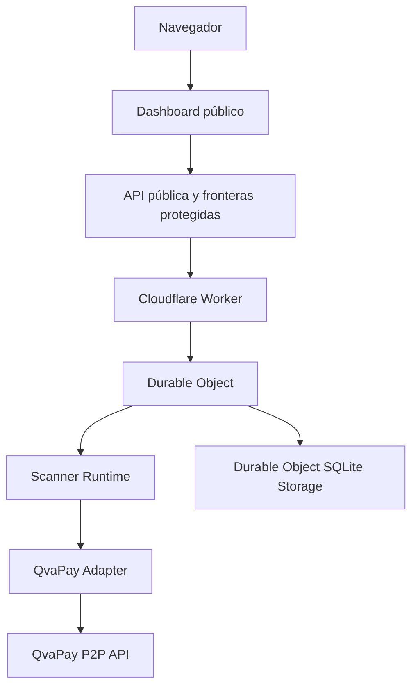

# Diagrama de contenedores

## Estado

Este diagrama representa la implementación vigente y separa explícitamente las capacidades futuras.

## Componentes

| Componente | Responsabilidad |
|---|---|
| Dashboard público | Presentación y acciones protegidas |
| Worker | Ruteo HTTP y fronteras de seguridad |
| Durable Object | Estado, snapshot y programación |
| Scanner Runtime | Coordinación del escaneo |
| QvaPay Adapter | Contrato, autenticación, paginación y mapeo |
| SQLite Storage | Persistencia del Durable Object |

D1, webhook, SSE y Event Ingestion Boundary no forman parte del despliegue actual.
