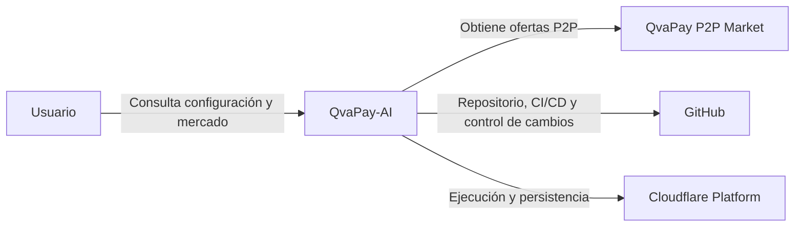

# Diagrama de contexto

> **Estado documental:** contexto objetivo del sistema; no representa una certificación de componentes implementados.

## Frontera objetivo del sistema

QvaPay-AI es responsable de ejecutar el escaneo, validar y normalizar datos, separar BUY/SELL, agrupar por mercado/moneda, ordenar por tasa, persistir snapshots y exponer información al frontend.

QvaPay-AI no modifica ofertas externas bajo los requisitos funcionales iniciales.