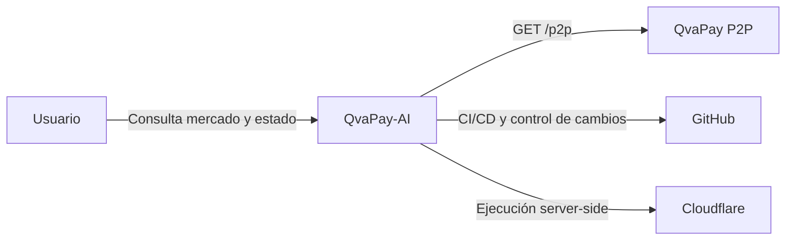

# Diagrama de contexto

## Estado

Representa el sistema desplegado actualmente.

## Frontera

QvaPay-AI consulta, valida, normaliza, clasifica y presenta ofertas P2P. También dispone de una frontera protegida para aplicar a una oferta.

El sistema no debe ejecutar estrategias automáticas de arbitraje sin requisitos y controles específicos.
